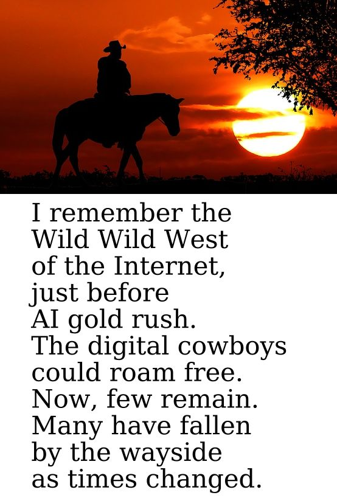

Personal link database, link aggregator, with RSS functionality.

## Use cases

 - RSS reader
 - Bookmark manager
 - YouTube link manager, frontend
 - Very simple search engine
 - data analysis - analyze link rot, how many a page is cited by other sources, analyze link domains, etc.

<div align="center">
  
</div>

# Features

 - bookmarks management, tags, and comment support
 - light mode and dark mode
 - access for multiple users
 - automatic exports
    - to directory
    - to GitHub
 - support for 'spaces'. You can define own spaces like 'music', 'videos', 'movies', etc. Manged by separate django apps
 - keywords entry analysis to find trends
 - kiosk mode. Auto refresh when URL is appended with param "auto-refresh" set to millisecond value
 - small foot-print. I am running this thing on RPI5

## Services

 - RSS feed support: Supports YouTube RSS, Reddit RSS, Odysee, OpenRss, OPML
 - support for archived pages through InternetArchive, or any configured archive medium
 - GitHub support. Exports. For example [Internet domains, users, projects](https://github.com/rumca-js/Internet-Places-Database), using tokens
 - YouTube download support through yt-dlp project
 - E-mail IMAP support (Gmail via app passwords)

### Gmail [under construction]

1. Create a Google Cloud project [here](https://console.cloud.google.com/projectcreate).
1. Open [Gmail in API & Services](https://console.cloud.google.com/apis/library/gmail.googleapis.com) and activate the Gmail API.
1. Open the [OAuth consent screen](https://console.cloud.google.com/apis/credentials/consent) and create a new consent screen. You only need to provide a name and contact data.
1. Next open [Create OAuth client ID](https://console.cloud.google.com/apis/credentials/oauthclient) and create credentials for a `Desktop app`. Download the credentials file and save it under `credentials.json` in the root of this repository.
1. Use credentials when devices source

Here is a detailed guide on how to create the credentials: [https://developers.google.com/gmail/api/quickstart/python#set_up_your_environment](https://developers.google.com/gmail/api/quickstart/python#set_up_your_environment).

## Crawling

 - some Internet crawling capabilities
 - link search. Simple implementation, does not use elastic search
 - does not support proxy rotation. This is ethical web crawling, it should not spam with requests
 - configurable user agents, crawlers, selenium, requests, chrome undetected, crawlee, easily extendible
 - if you need a real web crawler, you may use scrapy, or apache nutch, etc.

## Privacy

 - local data, no algorithms, no advertisements, self-hosted
 - local user action tracking. You can observe and analyze history of your 'views', 'searches', 'comments', 'browsing history'
 
<div align="center">
  
</div>

## Suite of projects

 - [Bookmarked links](https://github.com/rumca-js/RSS-Link-Database)
 - [Internet domains, users, projects](https://github.com/rumca-js/Internet-Places-Database)
 - [daily RSS Git repository for the year 2025](https://github.com/rumca-js/RSS-Link-Database-2025)
 - [daily RSS Git repository for the year 2024](https://github.com/rumca-js/RSS-Link-Database-2024)
 - [daily RSS Git repository for the year 2023](https://github.com/rumca-js/RSS-Link-Database-2023)
 - [daily RSS Git repository for the year 2022](https://github.com/rumca-js/RSS-Link-Database-2022)
 - [daily RSS Git repository for the year 2021](https://github.com/rumca-js/RSS-Link-Database-2021)
 - [daily RSS Git repository for the year 2020](https://github.com/rumca-js/RSS-Link-Database-2020)
 - [Online domains viewer](https://rumca-js.github.io/quickstart/public/static_lists/viewerzip.html)

## Links

 - [Screenshots](https://github.com/rumca-js/Django-link-archive/blob/main/README_ui.md)
 - [Installation, configuration](https://github.com/rumca-js/Django-link-archive/blob/main/README_install.md)
 - [Backup and Restore operations](https://github.com/rumca-js/Django-link-archive/blob/main/README_datamanagement.md)
 - [Notes about search industry](https://github.com/rumca-js/Django-link-archive/blob/main/README_search.md)
 - [Data analysis](https://github.com/rumca-js/Django-link-archive/blob/main/analysis/readme.md)
 - [Development](https://github.com/rumca-js/Django-link-archive/blob/main/README_development.md)

## Alternatives

Alternative programs for link bookmarking do exist.

[Hoarder](https://hoarder.app/),
[Grimoire](https://github.com/goniszewski/grimoire),
[LinkWarden](https://github.com/linkwarden/linkwarden)
[BookmarkOS](https://bookmarkos.com/),
[Raindrop](https://raindrop.io/),
[LinkAce](https://www.linkace.org/),
[GGather](https://web.ggather.com/),
[Zotero](https://www.zotero.org/),
[OneKeep](https://onekeep.com/),
[Lasso](https://www.lasso.net/go/),
[CarryLinks](https://carrylinks.com/),
[Zlinky](https://zlinky.com/),
[wakelet](https://wakelet.com/),
[Booky](https://booky.io/),
[Webtag](https://webtag.io/),
[Historious](https://historio.us/),
[Knowies](https://www.knowies.com)

Awasome list at [Github](https://github.com/awesome-selfhosted/awesome-selfhosted?tab=readme-ov-file#bookmarks-and-link-sharing).

# How does it work?

 - System reads "sources" regularly
 - Each "source" is checked regularly for new data. RSS feeds are one type of source
 - new links are inserted into database
 - every day your bookmarks can be exported to a repository, if configured
 - new links are used to populate popular "keywords"

# Ranking algorithm

Each page is ranked by several factors.

 - content ranking. [0..100] range
 - users votes. [-100..100] range
 
The result is equal according to calculation
 - page ranking = content ranking + users votes

# Content ranking

To have a good page rating, it is desireable to follow good standards:
 - [Schema Validator](https://validator.schema.org/)
 - [W3C Validator](https://validator.w3.org/)
 - Provide HTML meta information. More info in [Open Graph Protocol](https://ogp.me/)
 - Provide valid title, which is concise, but not too short
 - Provide valid description, which is concise, but not too short
 - Provide valid publication date
 - Provide valid thumbnail, media image
 - Provide a valid HTML status code. No fancy redirects, JavaScript redirects
 - Provide RSS feed. Provide HTML meta information for it [https://www.petefreitag.com/blog/rss-autodiscovery/](https://www.petefreitag.com/blog/rss-autodiscovery/)
 - Provide search engine keywords tags

Your page, domain exists alongside thousands of other pages. Imagine your meta data have an impact on your recognition, and page ranking.

Remember: a good page is always ranked higher.

You may wonder, why am I writing about search engine "keywords" meta field, if Google does not need them. Well I don't like Google. If we want alternative solutions to exist, it should be possible to easily find your page from simpler search engines. Provide keywords field if you support open web.

## Votes ranking

Database is managed by RSS link database, and user votes. Average of votes is calculated for each link.

# Export

There are several export types. Each day data can be exported.

The exports support JSON file structure.

We maintain some data, but it is not [archive.org](https://archive.org) replacement. We store only meta data about web pages: title, description, thumbnail.

Most of the views contain "Show JSON" button that provides the view data as JSON. This can be used by scripts, for import, export.

Types of exports:
 - daily data - each day has its own directory
 - yearly data - each year holds information separately
 - data not time related - data are in separate directories, and are not time related

# Import

Done by admin panel. JSON data files can be used for imports, or other django-link-archive apps [under construction].

# API keys

Administrator can create API keys for not logged users to access the contents.

Format:
```
https://yourpage.com/your-app/index?key=yourgeneratedkey
```

# History

You can keep locally your own web browsing history. Forget about browser history or bookmarks.

With this self-hostied solution you do not need to sync anything, as everything resides on this server.

Forget about YouTube video browsing history, or subscriptions. You can control what you see and when!

# Scripts

Web-crawling functionality can be also used without django.

There are some scripts that can be used without Django application:
 - yafr.py - yet another feed reader, commandline client
 - page_props.py - commandline tools that shows page properties
 - example_page_crawler.py - example script that can crawl through web page
 - example_compare_crawlers.py - shows how much time it takes to execute different crawlers
 - converter.py - converts JSON files to SQLite table
 - dataanalyzer.py - analyzes data in JSON files / SQLite table. You can query the data
 - script_server_flask.py - flask server that can be used as a proxy for requesting URLs
 - workspace.py - workspace management. Can be used to update project
 - backup.py - script to backup postgreSQL data

# Ease of navigation

This project was created to give libary of navigation. Therefore from a link there should be navigation to other places:

 - google
 - other search engines, wikipedia, etc
 - link to internet archive, etc.

Even if Google implements links to internet archive, or introduces most of these features we should continue our work on this, as we never know when corporation decides not to support it.

# Federated [under construction]

This project is federated. Therefore you can rely on data from other djang-link-archive instances.

You can:
 - define proxy source of automatic import from other link archive instance
 - manually import links from another link archive instance, or

## Proxy sources [under construction]

First lets define a scenario. You have instance A and instance B. Instance B has defined a source.

You do not want instance A to fetch same data from the internet. You would like to fetch data from instance B.

To do that:
 - Navigate to instance B sources.
 - Find your desired source.
 - Click "Show JSON" (copy location of that address)
 - Navigate on instance A to sources.
 - Add a new source
 - paste the instance B address, the JSON address link
 - the system should suggest source type to be of JSON

# User management [under construction]

Project uses default user auth module.

Roadmap for the end game.

 - at first only administrator can add new users. For running instance contact administrator
 - you do not create passwords, they are generated for you, with a proper complexity. Please write them down
 - contact other users, other users can also add new users, if karma allows it

Karma effect on the user:
 - if your karma goes below 0 your account is banned
 - after certain threshold you can submit new links
 - after certain threshold you can submit comments
 - after certain threshold you can upvote and downvote comments
 - after certain threshold you create users (1 per day)

What causes karma change:
 - admin, or moderators
 - adding vote for a link
 - upvotes, or downvotes on comments
 - bans of other users you invited

User actions are tracked by the system, only if it is configured so:
 - users can post comments for entries
 - users can tag entries
 - users can vote for entries
 - system stores limited amount of search queries, the user can select previous queries from combobox
 - system stores order of visits on entries. This allows to provide "related" section for each entry. For example if you vist entry "X" after "Y", then "X" will appear on "Y" related section

## Rationale

Many programs exists, but most of them have some limitations.

 - License: some clients are not open source, or not entirely open source (for example Reddit). Some programs are not programs from users perspective, but a service: Feedly, Pockets, Readwise Reader. They require account. Their Terms and service can change
 - Interface: Most of the RSS programs are GUI: Thunderbird, Feeder. I wanted a web page, an app that can be accessed from anywhere
 - missing search ability (NextCloud "News" application, Thunderbird, Feeder Android app, Newsboat Linux app)
 - missing tag support (Thunderbird, Android Feeder app)
 - some programs do not provide link rating
 - Import / Export: most programs do not provide easy way to do that (I want JSON files!)
 - Scale: Some projects are BIG. This project focuses on providing "single user" experience. I do not want many dependencies here
 - Goal: Reddit, Lemmy aim is to provide social media experience, this project aims to grant the ability to create database of links

# Additional notes

What grinds my gears?
 - Google does not provide easy way to see cached site, like archive.org. They have it, they just do not let you access it
 - It is not easy to discover new places on the Internet. When did you found any 'new' site worth seeing? A blog? Personal site? Google has index of billions of pages, yet the Internet looks empty
 - Old web page will never be at first place in Google Search
 - There is no button in Google search to translate the destination link
 - YouTube provides "related" section for videos. Why Google does not provide 'related' link list in search?
 - It is really difficult to find anything about Amiga, or old tech stuff
 - First page fallacy. Second Google Search result do matter. Second Google Search page also matters. If I search for "PHP" there are thousands of frameworks, projects worth seeing. Why I cannot find them easily using Google Search? We give Google Search too much credit

Archive.org:
 - Is not reliable. Sometimes it gets painfully slow. It is still better than nothing
 - Most mainstream media RSS is covered, but the coverage is spotty. Not all days are covered
 - Internet Archive (archive.org) does not provide snapshots for each and every day for all RSS sources. It is sometimes pretty slow. We would like to be sure that a such snapshot takes place. Therefore we need to export links to daily repo ourselves. Django RSS app also makes requests to archive to make the snapshots

# Legal

 - I do not endorse any link every link in the database. I may some links be important because of how bad the content is. I use irony often, therefore beware!
 - Everyone has a right to be forgotten. If any link should be removed from a database please contact me
 - I do not obtain any form of monetary compensation from link, or data about it. The data link information were already provided by RSS sources. The RSS source is responsible for what they provide free of charge

# Ending notes

All links belong to us!
