# Link lists

Available link display types
 - standard view
 - similar to YouTube
 - similar to web search engine

## Standard list

  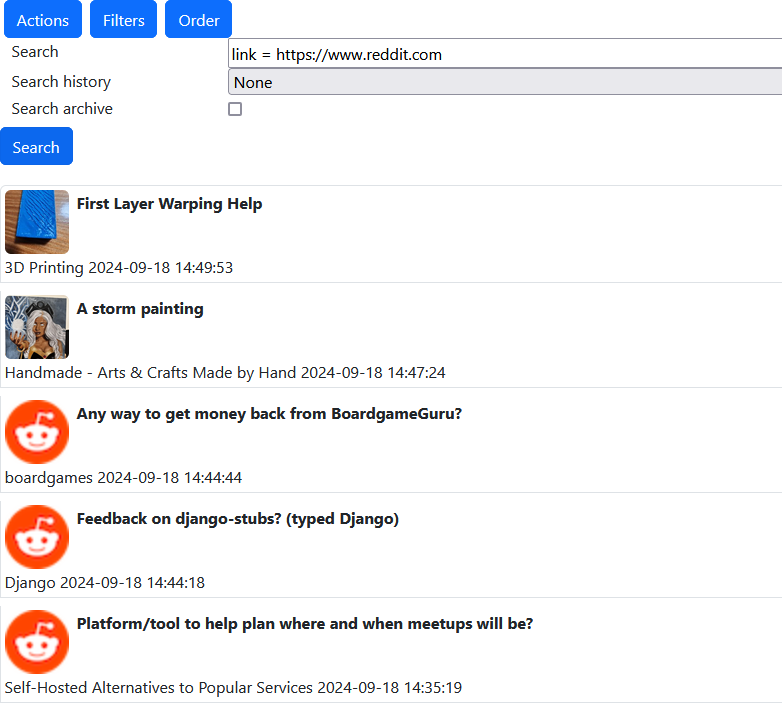

## YouTube list

  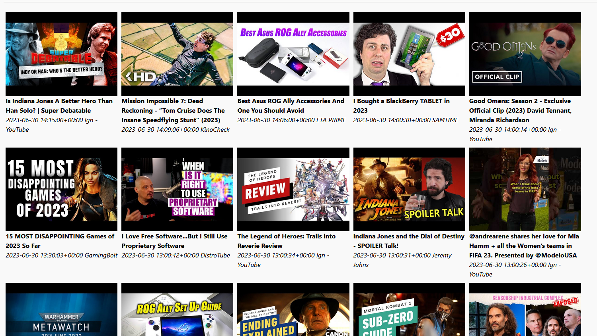

## Search engine view

  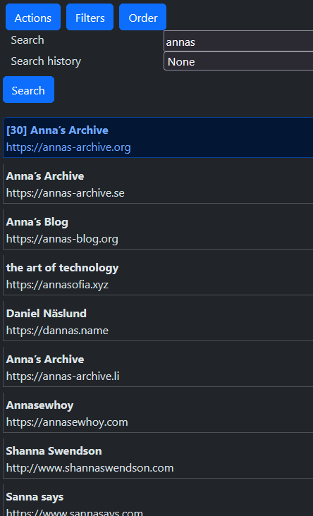

## Dark theme

  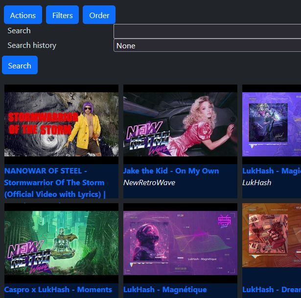

# Search form

  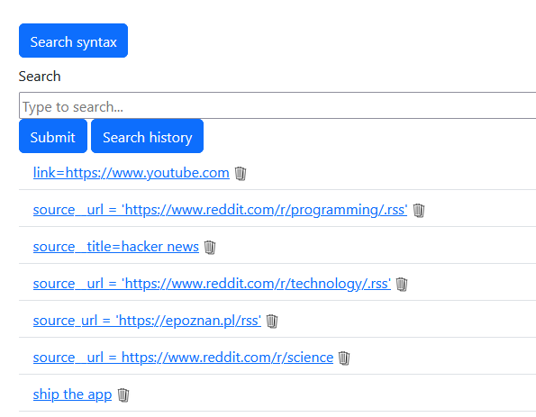

# Entry, link details

  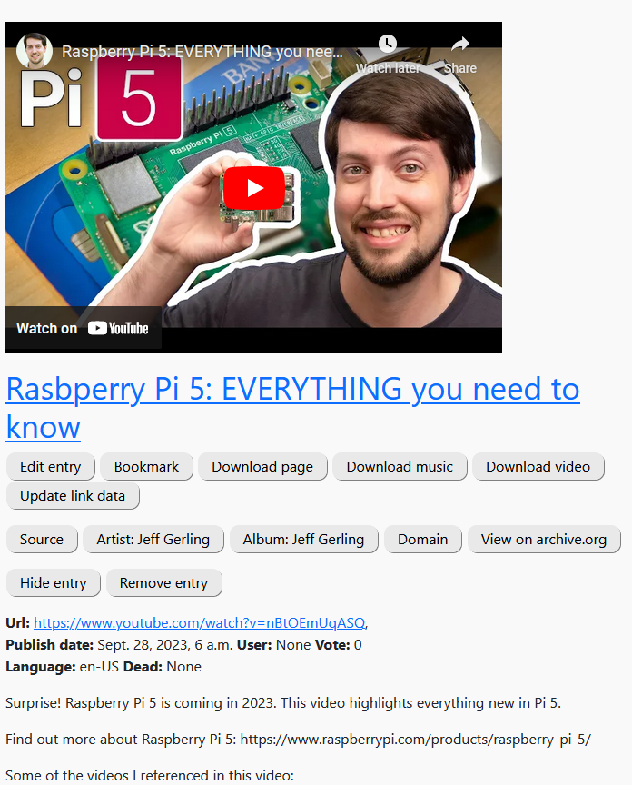

# Sources

  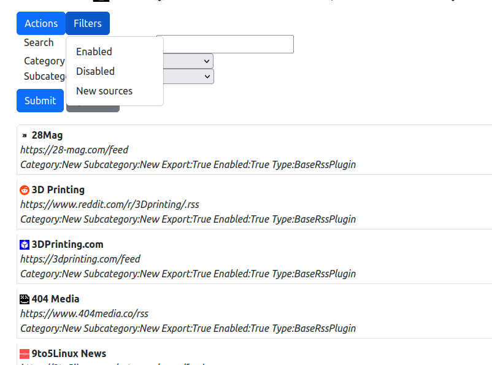

# Source details

  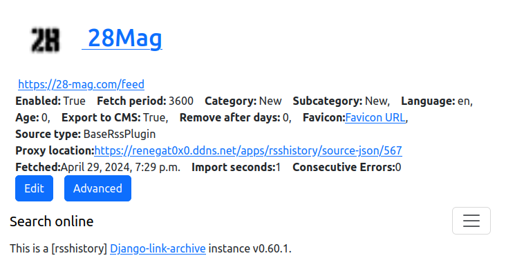

# Tags, keywords, and other views

  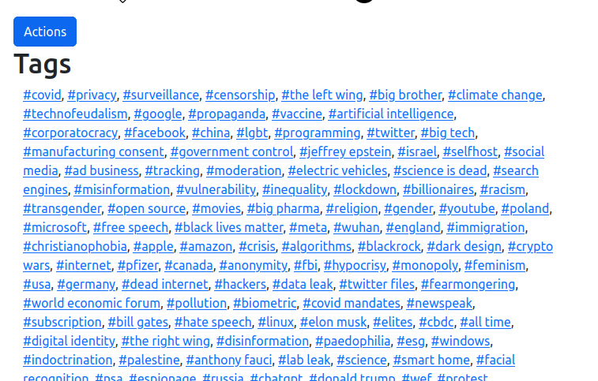

  

# Admin

Administrative tasks require admin privileges. Configuration needs to be done with care, as timings might be crucial for your system to be operating correctly.

Thankfully there are three wizard views that can automatically preset most of the important settings.

## Configuration page

  

## Server status

  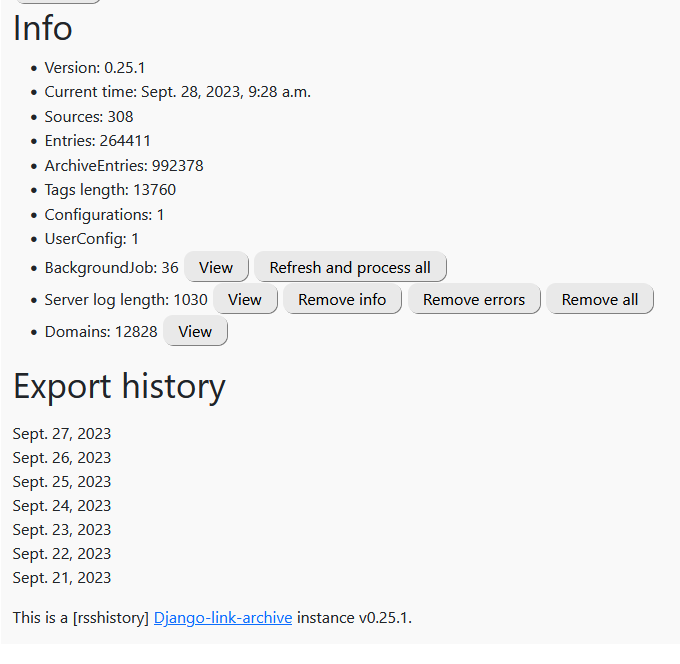

## User configuration

  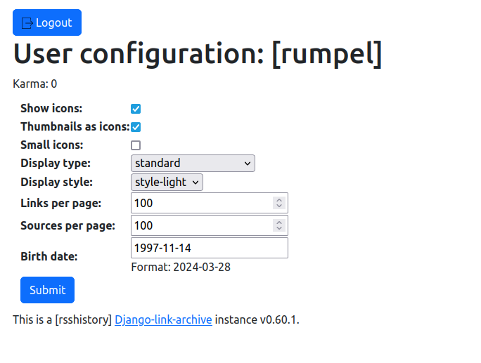

## Logs

  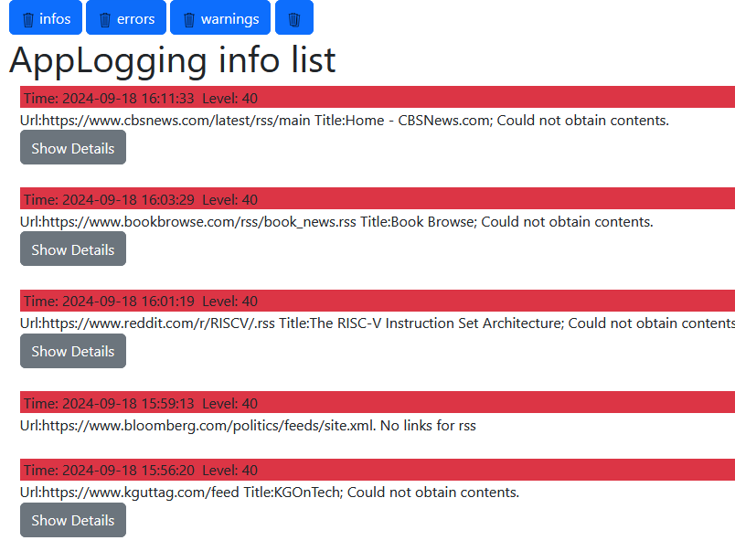

## Background jobs

  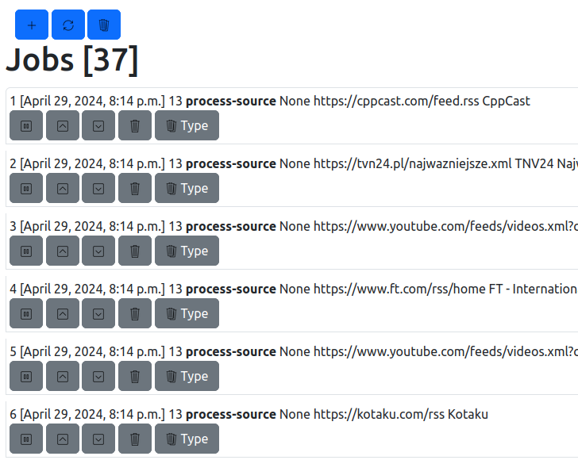

