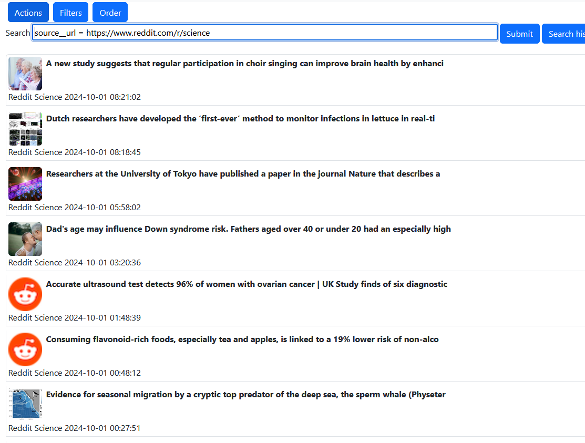
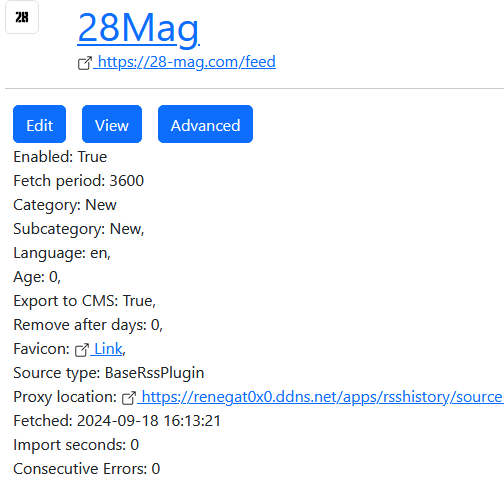
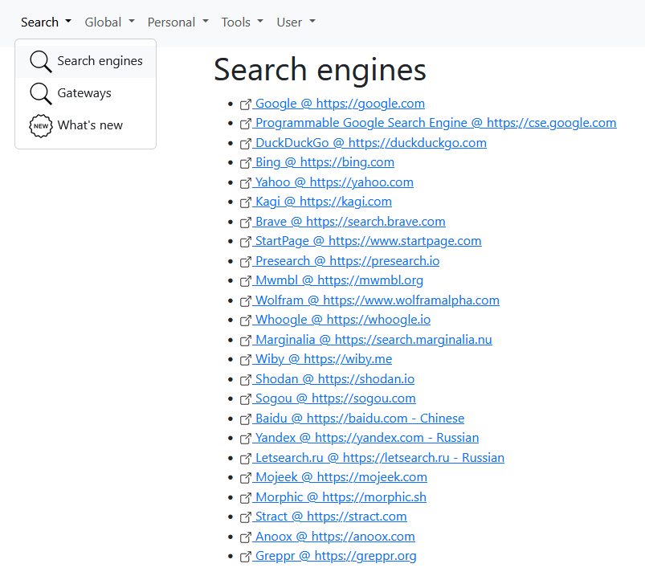
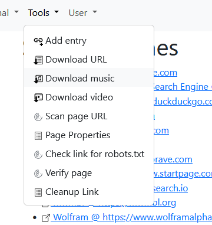
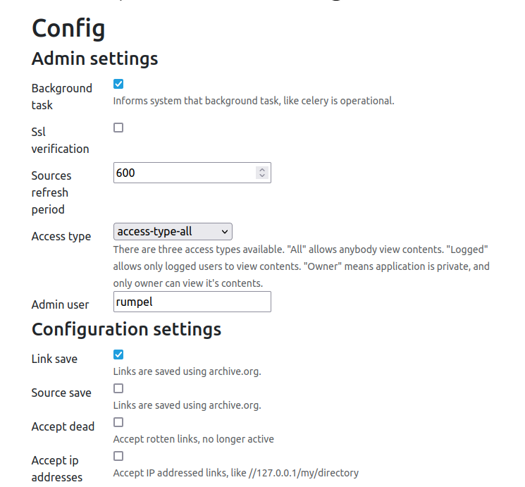
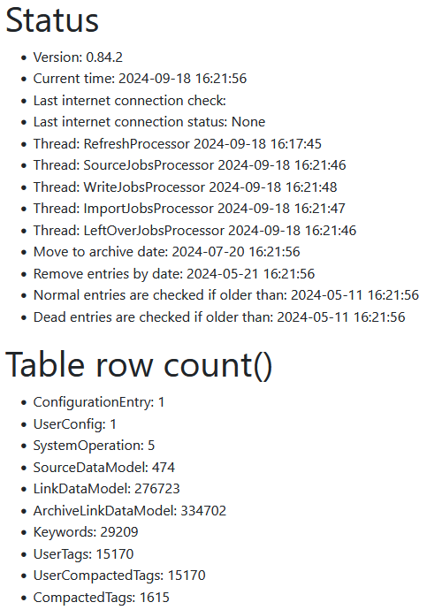

Program can operate in various setups, scenarios, but mainly there are three types of views

 - standard view, designed for RSS news reading
 - galler view, similar to YouTube
 - search engine view

## Standard list

  

## YouTube list

  

## Search engine view

  

## Dark theme

  

# Search form

  

# Entry, link details

  

# Sources

  

# Source details

  

# Tools

Program offers many tools. If you try to find something a list of search engines is provided.

There are also tools that can:

 - scan, or verify, or analyze a page
 - download data

  

  

# Tags, keywords, and other views

  

  

# Admin

Administrative tasks require admin privileges. Configuration needs to be done with care, as timings might be crucial for your system to be operating correctly.

Thankfully there are three wizard views that can automatically preset most of the important settings.

## Configuration page

  

## Server status

  

## User configuration

  

## Logs

  

## Background jobs

  

